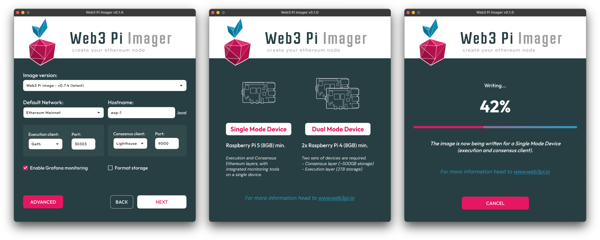
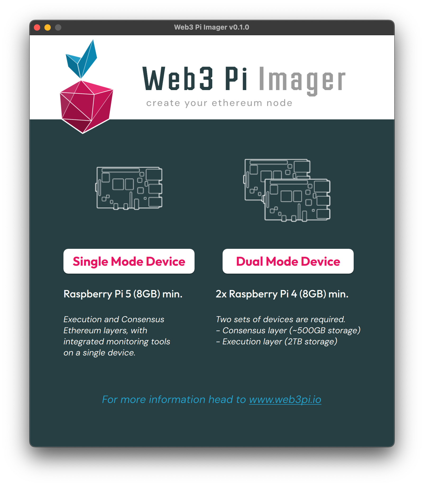
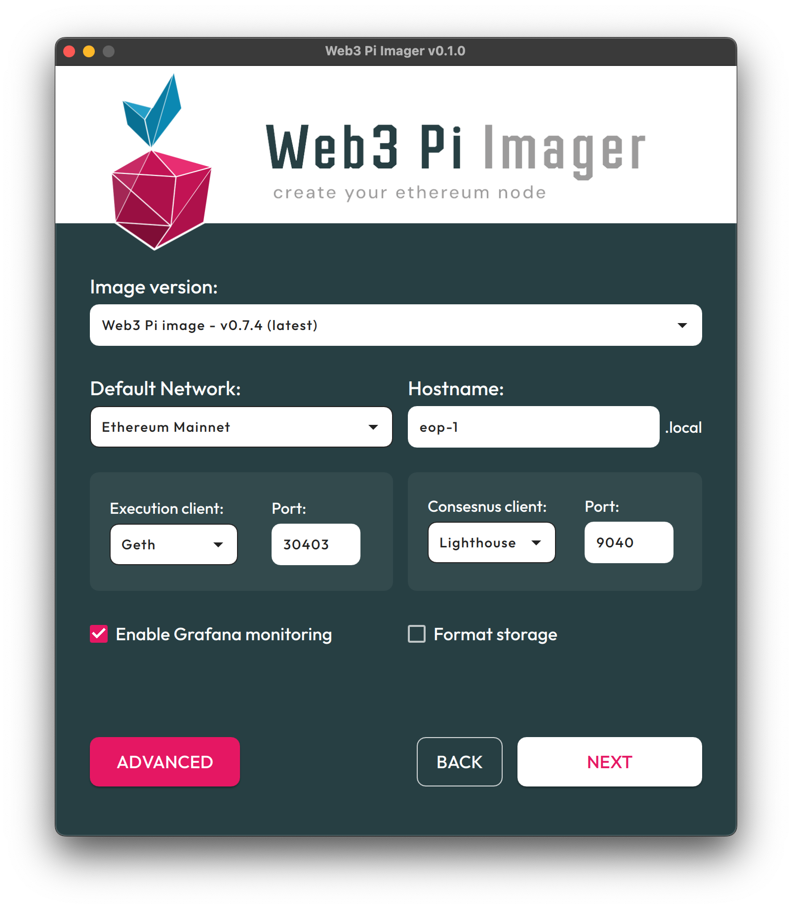
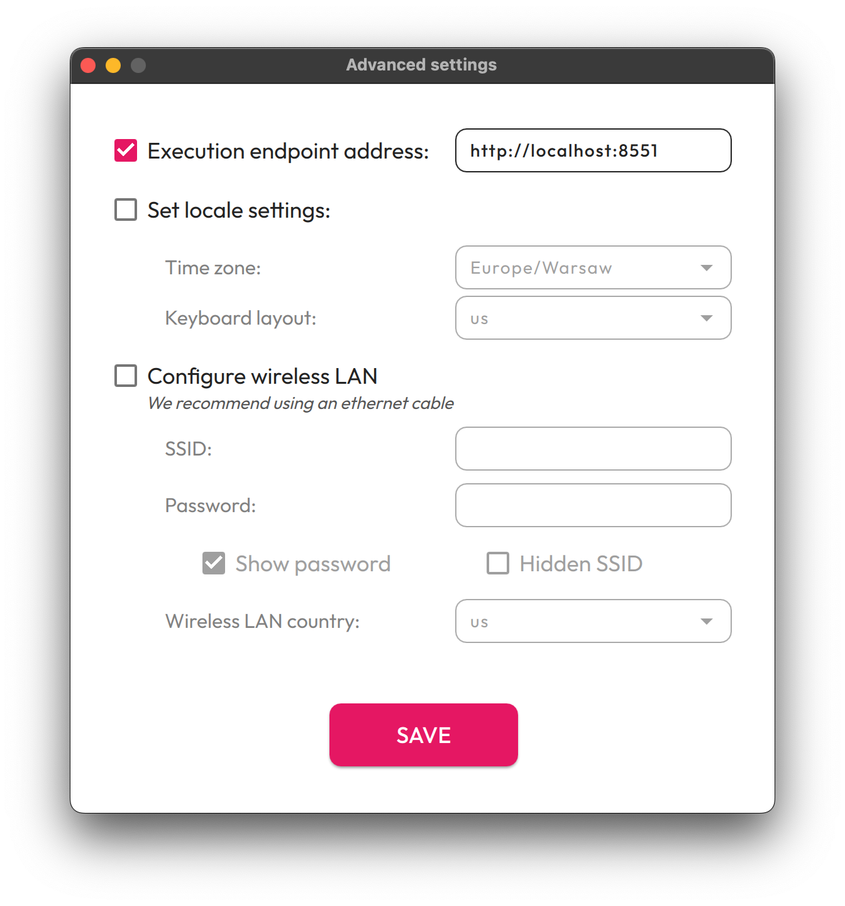
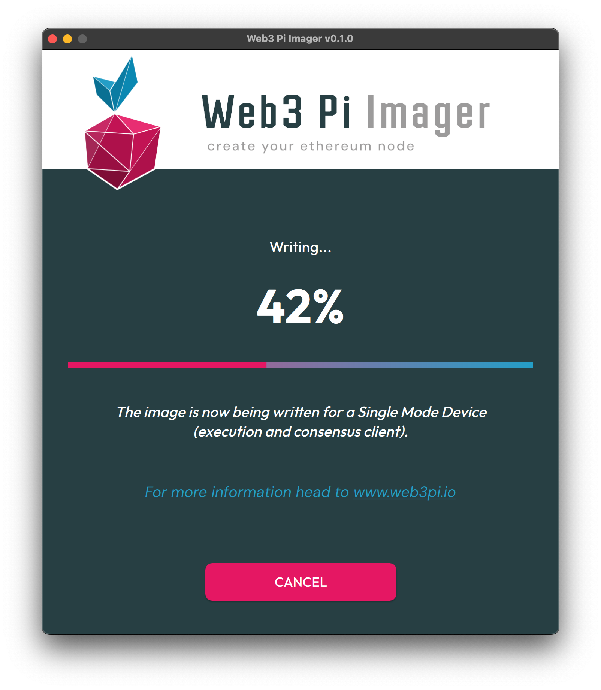

# Web3 Pi Imager

**Web3 Pi Imager** is a user-friendly application designed to simplify the process of burning [Web3 Pi images](https://github.com/Web3-Pi/Ethereum-On-Raspberry-Pi/releases/latest) images. In just a few clicks, you can prepare your Raspberry Pi to function as a full Ethereum node. The application provides step-by-step guidance and offers an intuitive interface for selecting settings, making it accessible even to non-technical users.

**Web3 Pi Imager** is built as a fork of the [Raspberry Pi Imager](https://github.com/raspberrypi/rpi-imager), customized specifically for Ethereum node deployment.

## Download

Download the **Web3 Pi Imager** application from the [latest release on GitHub](https://github.com/Web3-Pi/web3-pi-imager/releases/latest).
Choose the appropriate binary for your operating system.

## Features

### Single or Dual Device Mode

Choose between running both execution and consensus layers on a single Raspberry Pi 5 or splitting them across two Raspberry Pi 4 devices.  

### Preparing Writing

Easily configure your SD card with pre-selected Ethereum client settings before starting the writing process.  

### Advanced Settings

Customize advanced configurations such as locale and network settings.  

### Writing Progress

Monitor the real-time progress of the image being written to the SD card.

---

## Installation and Usage

Download the Web3 Pi Imager application from the [latest release on GitHub](https://github.com/Web3-Pi/web3-pi-imager/releases/latest).
Choose the appropriate binary for your operating system.

### 1. Selecting the Mode

The user can choose between two modes: **Single Mode Device** and **Dual Mode Device**. Each mode is tailored for different hardware setups and use cases:

- **Single Mode Device**:
  - This mode runs both the **execution layer** and the **consensus layer** on a single Raspberry Pi.
  - It is designed for newer hardware, such as Raspberry Pi 5 (minimum 8GB RAM), which can handle both layers on a single device.
  - This option is ideal if you want a simpler setup without splitting the workload across multiple devices.

- **Dual Mode Device**:
  - This mode splits the **execution layer** and the **consensus layer** onto two separate devices.
  - It is recommended for older hardware, such as two Raspberry Pi 4 devices (minimum 8GB RAM each).
  - In this setup:
    - The **execution layer** (e.g. handling transactions and smart contracts) requires ~2TB of storage.
    - The **consensus layer** (e.g. verifying blocks) requires ~500GB of storage.
  - This option provides flexibility for devices with lower performance or limited resources.

### 2. Initial Configuration

- **Single Mode Device**:  
  This mode allows you to run both the execution layer and consensus layer on a single device, such as a Raspberry Pi 5. In this mode, you can configure the following parameters:
  - Image version (e.g. Web3 Pi image v0.7.4).
  - Default network (e.g. Ethereum Holesky).
  - Hostname for the device (e.g. `eop-1.local`).
  - Execution client and port (e.g. Geth, port 30303).
  - Consensus client and port (e.g. Lighthouse, port 9000).
  - Optionally, enable Grafana monitoring or format the external storage device before installation.

- **Dual Mode Device**:  
  This mode splits the execution layer and consensus layer onto two separate devices, which is particularly useful for older hardware like Raspberry Pi 4. For each device, you can configure:

  - **Execution Device**:
    - Hostname (e.g. `eop-1-exec.local`).
    - Execution client (e.g. Geth) and port (e.g. 30303).

  - **Consensus Device**:
    - Hostname (e.g. `eop-1-cons.local`).
    - Consensus client (e.g. Lighthouse) and port (e.g. 9000).

### 3. Advanced Settings

Regardless of the mode selected, you can access advanced settings to configure:
- Execution endpoint address (e.g. `http://localhost:8551`).
- Locale settings such as time zone and keyboard layout.
  - By default, the keyboard layout will use the system's default settings unless explicitly configured.
- Wireless LAN configuration, including network name (SSID) and password.

After clicking **Save**, the settings will be stored and automatically restored the next time you launch the application.

**Note**: Activating the Wi-Fi configuration feature will attempt to retrieve Wi-Fi credentials from the system. Depending on your operating system, this may trigger a request for elevated system permissions to access network configuration data.

### 4. Starting the Writing Process
   After completing the configuration, click **Next** to proceed to selecting the storage device where the image will be written to the SD card.

### 5. Writing and Verification Process
  - After selecting the storage device, the application will begin writing the image to the SD card.
  - Once the writing process is complete, the application will automatically verify the data to ensure it was written correctly.

### 6. Final Instructions

After verification, the application will display detailed instructions on the next steps, depending on the selected mode:
- In **Single Mode Device**, insert the SD card into your Raspberry Pi, connect it to the network, and power it on.
- In **Dual Mode Device**, prepare two separate SD cards and follow the instructions for each device (one for the execution layer and one for the consensus layer).

At this stage, if the writing process completed successfully, you can finish and install the prepared SD card into your device at a later time.

Alternatively, you can proceed with the next steps as described in the instructions, which explain how to monitor the installation process of the system on your device.

#### Additional Notes:
- After inserting the SD card into the device and connecting all cables (including internet), wait approximately **2-3 minutes** for the installer to start the necessary services for monitoring the installation. The installation monitor will be available under the hostname provided during the initial configuration.
- Once the installation completes successfully, you can log in to the device using **SSH**. The default credentials are:
  - **Username**: `ethereum`
  - **Password**: `ethereum`
---

## Contributing

If you’d like to contribute to the Web3 Pi Imager project, please follow the instructions provided in the [Contributing Guide](CONTRIBUTING.md).

---

## Disclaimer

Raspberry Pi is a trademark of Raspberry Pi Ltd. The use of this trademark here is solely for descriptive purposes.

---

## License

This project is licensed under the [Apache License 2.0](http://www.apache.org/licenses/LICENSE-2.0).

This project is a fork of the [Raspberry Pi Imager](https://github.com/raspberrypi/rpi-imager), originally licensed under the Apache License 2.0. It includes modifications to support Ethereum node deployment.

The main code of the Web3 Pi Imager is made available under the terms of the Apache License. For more details, see the [`license.txt`](./license.txt) file. Additionally, this project uses various third-party dependencies such as Qt, libarchive, drivelist, mountutils, and libcurl, which are subject to their respective open source licenses. For more information, consult the relevant files in the `src/dependencies` folder.
